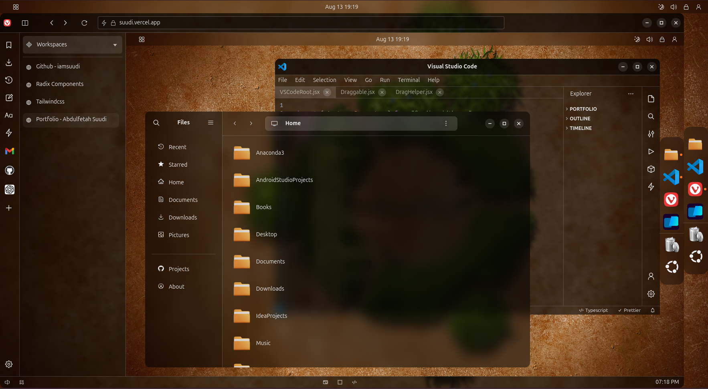

# Ubuntu Workspace Clone

Website: https://suudi.vercel.app/

---

## Tech Stack

-   **Front End:** React | JavaScript | TailwindCSS
-   **Other Libraries:** Radix-UI | Prism-React-Renderer

---

## Goal

My goal was creating unique portfolio that just mimics my ubuntu desktop. Feel free to clone and customize it

---

## Key Features

-   Booting impression.

-   Apps can minimized and placed on top of eachother/

-   Apps can dragged in the viewport.

-   Removable Notications and Calendar Panel.

-   Awesome recent apps viewer.

-   Menu panel with wifi, sound, and bluetooth buttons.

-   Apps dialog which shows my skills.

-   VS-Code has tabs and codes can be edited.

-   Audio player, Image Viewer and Pdf Reader apps.

-   FileManager has path header, carets and side-buttons for navigation.

-   All folders and files can be opened. Recent opened files are tracked.

-   Vivaldi browser which displays the same website again.

---

## What I learned

I learned using tree-like structure in filemanager which simplified the navigation of files and folders for me. 

Minimizing apps, putting them over eachother and actually changing their their z-index was just very simple once I got the data-strucuture right. Acutally I used Queue and Stack exchangeably.

---

## Project Images

**Landing Page**

This is the landing page for my web application. I added some cool scroll animaions.


**Vivaldi Browser**

This is the the same website being opened and run inside a browser. Opened apps are from the second instance of the website



## Setup

Installation:

```bash
git clone git@github.com:iamsuudi/ubuntu.git
```

Install Dependencies:

```bash
pnpm install
```

Running Dev Server:

```bash
pnpm dev
```

Running Prod Server:

```bash
pnpm build
pnpm start
```
